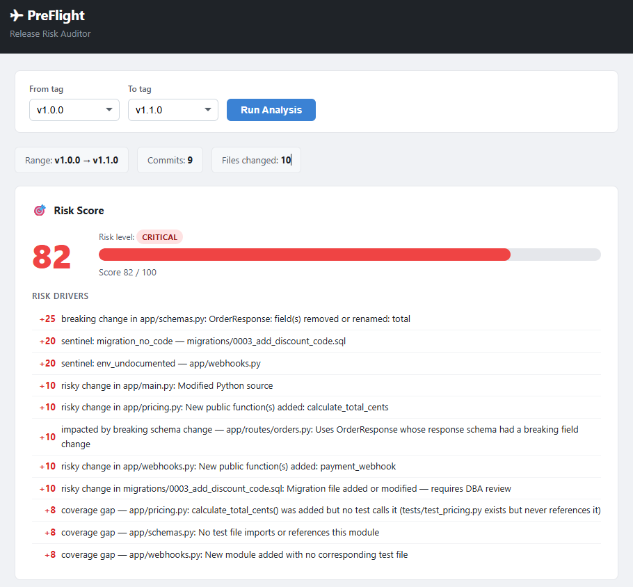

<!-- assisted-by: IBM Bob 2.0 final-polish (README first draft); revised by the developer -->
# PreFlight — Release Risk Auditor



**PreFlight** answers one question before every release: *"what could this deploy break?"*
Give it two git tags and it analyses everything that changed between them, then shows a
**Release Readiness Report** in a local web dashboard: a risk score, risk-classified changes,
test coverage gaps, migration / config / environment mismatches, drafted release notes and a
rollback plan. Everything runs on your machine, with no cloud services and no language model at runtime.

## Quick start

Requirements: Python 3 (tested on 3.11 and 3.13) and git.

**Windows**

```bat
run.bat
```

**Linux / macOS**

```bash
chmod +x run.sh
./run.sh
```

The script installs the dependencies, creates the demo repository `sample-repo/` from
`sample-repo.bundle` on first run, and starts the server. Then open
<http://127.0.0.1:8000>, choose two tags (From = older, To = newer) and click **Run Analysis**.

To analyse your own repository, pass its path: `run.bat C:\path\to\repo` or `./run.sh /path/to/repo`.

## The problem

Before shipping a release, someone has to compare the diff by hand: does every migration have
matching code, is every new environment variable documented, does every new function have a test,
did a public API change break existing clients? This is slow, easy to get wrong under time
pressure, and the mistakes it misses show up in production. PreFlight automates these checks.

## How it works

| Step | Module | What it does |
|------|--------|--------------|
| Diff engine | `app/diff_engine.py` | Classifies each changed file as `breaking`, `risky` or `safe`, with a reason (Python AST comparison plus heuristics). Docstring-only changes and test files are safe. |
| Coverage mapper | `app/coverage.py` | Finds the test file for each changed module and checks that every new public function is referenced by a test. Generates stub tests for the gaps. |
| Sentinel | `app/sentinel.py` | Detects SQL migrations with no matching code, environment variables missing from `.env.example`, and breaking API response changes. |
| Drafter | `app/drafter.py` | Drafts release notes and a changelog from the commit messages and findings, a "fix before release" list, and an ordered rollback plan. |
| Orchestrator | `app/report.py` | Merges the findings, avoids double-counting one root cause, and computes a 0–100 score: `round(100 * (1 - exp(-raw / 80)))`. Bands: 0–24 low, 25–49 medium, 50–74 high, 75+ critical. |

The FastAPI backend (`app/main.py`) exposes `GET /api/tags` and `GET /api/report?from=<tag>&to=<tag>`.
Invalid ranges (unknown tag, equal tags, or `from` newer than `to`) return HTTP 400.
The dashboard (`app/static/index.html`) is a single HTML/JS file with no build step.

## Demo repository and the four planted issues

`sample-repo` is a small FastAPI orders service with 21 commits and two tags. Between `v1.0.0`
and `v1.1.0` (9 commits, 10 files) four realistic problems were planted, plus some harmless changes:

| Planted issue | Where | How PreFlight catches it |
|---------------|-------|--------------------------|
| Schema migration with no matching code | `migrations/0003_add_discount_code.sql` adds `discount_code`, nothing uses it | Sentinel: `migration_no_code` (high) |
| Backward-incompatible API change, no version bump | `OrderResponse.total` (float) became `total_cents` (int) in `app/schemas.py` | Diff engine: `breaking`; Sentinel: `api_breaking` (high) |
| Undocumented environment variable | `PAYMENT_WEBHOOK_SECRET` is read in `app/webhooks.py` but absent from `.env.example` and the README | Sentinel: `env_undocumented` (high), also listed under "Fix before release" |
| Changed module without test coverage | `calculate_total_cents()` was added to `app/pricing.py`; `tests/test_pricing.py` never calls it | Coverage mapper: function-level gap plus a stub test |

Result on the sample release: **score 82, critical**. The report is generated in about 0.05 s
(measured on the API), and every section is populated from real analysis.

## Report JSON (short form)

```jsonc
{
  "range":    { "from": "v1.0.0", "to": "v1.1.0", "commits": 9, "files_changed": 10 },
  "risk":     { "score": 82, "level": "critical", "drivers": [ { "label": "...", "points": 25 } ] },
  "changes":  [ { "path": "...", "status": "modified", "risk": "breaking", "reason": "..." } ],
  "coverage": { "gaps": [ ... ], "covered": [ ... ], "stubs": [ ... ] },
  "sentinel": { "findings": [ { "kind": "migration_no_code", "severity": "high", "location": "...", "detail": "...", "evidence": "..." } ] },
  "drafts":   { "release_notes_md": "...", "changelog_md": "...",
                "pre_release_fixes": [ { "action": "...", "reason": "..." } ],
                "rollback_steps":   [ { "step": 1, "action": "...", "reason": "..." } ] }
}
```

The full schema is in [`app/models.py`](app/models.py).

## Tests

```bash
python -m pytest tests/ -q
```

121 tests across 5 modules (diff engine, coverage, sentinel, drafter, report). No external services needed.

## Limitations

PreFlight uses deterministic heuristics (git, Python `ast`, regular expressions). It is built for
Python / FastAPI-style projects with SQL migrations and `.env.example`, and it has been tested on the
included sample repository. Other stacks would need new rules. It flags risk for human review;
it does not replace it.

## How IBM Bob was used

All application code in this repository was written by IBM Bob 2.0 in the Bob IDE. I directed each
phase, ran and reviewed the results, and decided what to fix. The task-by-task record is in
[`BOB_USAGE.md`](BOB_USAGE.md), and the session summary screenshots are in [`bob_sessions/`](bob_sessions/).

- **Project rules:** Bob saved the stack, non-goals and conventions in `AGENTS.md`.
- **Plan mode:** Bob produced `docs/PLAN.md` (module layout, data flow, report schema, subagent delegation), using an explore subagent to inspect the workspace first.
- **Agent mode, sample repo:** Bob built `sample-repo/` with 21 commits, two tags and the four planted issues.
- **Parallel subagents, phase 3a:** after writing the shared models and git utilities, Bob ran three subagents at once (diff engine, coverage mapper, sentinel). It noticed a problem with one subagent's test fixture and fixed it; 51 tests passed.
- **Parallel subagents, phase 3b:** two subagents (drafter, dashboard) ran in parallel, then Bob wrote the orchestrator, the API and the run scripts; 80 tests passed.
- **Review and fix rounds:** after each phase I ran PreFlight and reviewed its output. That review found real problems: a false coverage reason, harmless changes flagged as risky, a risk score that saturated at 100, stub tests that would overwrite existing files, reversed tag ranges accepted by the API, and a dropdown that adjusted in the wrong direction. I gave Bob the list and Bob implemented the fixes and their tests, catching and correcting two of its own failing tests on the way. The suite grew from 80 to 121 tests.
- **Manual changes by me:** I unpinned the versions in `requirements.txt` so it installs on Python 3.13 on Windows, and I captured the screenshots in `docs/` and `bob_sessions/`.

Bob used about 27 of the 40 Bobcoins available for the hackathon.

## License

MIT, see [`LICENSE`](LICENSE).
